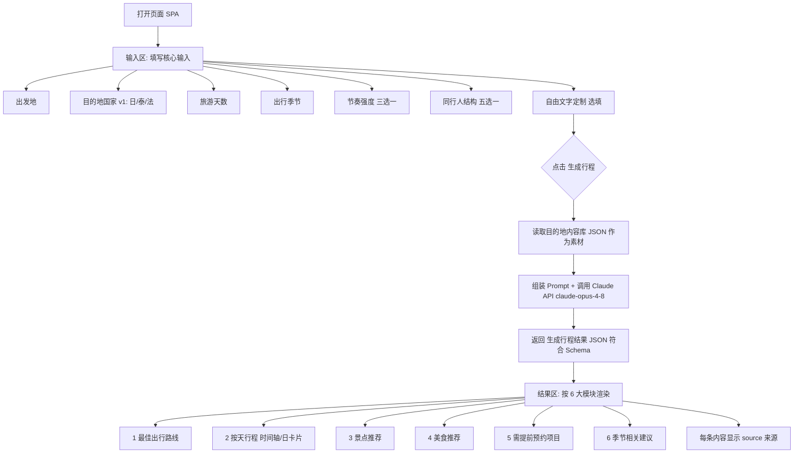

# 旅游行程规划应用 PRD（M1）

> 文档版本：v1.0（M1 地基版）
> 状态：已锁定方向，供 UI / 运营 / AI生成 / 测试 各 agent 照此执行
> 配套文档：`docs/schema.md`（带注释的数据结构说明）、`docs/schema.json`（机器可读 JSON Schema）

---

## 1. 产品定位与目标用户

### 1.1 产品定位

一个**本地可运行的多人旅游行程规划单页应用（SPA）**。

- 纯前端静态站点，无后端服务。
- 用 `python -m http.server` 即可在局域网内启动，同一 WiFi 下多人可同时访问、各自规划。
- 行程内容由两部分构成：
  1. **运营预置的真实数据**（目的地内容库，离线静态 JSON）；
  2. **Claude API 实时生成/微调**的个性化行程（在线调用）。
- 本地运行需用户自行配置 Claude API key（放在不入 git 的 `config.js` 占位文件里）。

### 1.2 目标用户

- 计划自由行、希望快速拿到一份「可直接照着走」的行程的个人或小团队。
- 典型场景：朋友几人凑一次出国游，想要一份按天排好、含路线/景点/美食/预约/季节提醒的行程，并能用一句话描述自己的特殊需求（带娃、蜜月、预算有限等）让方案自动调整。

### 1.3 设计原则

- **结构化 + 自由文字**：用结构化维度保证生成质量稳定，用自由文字层覆盖长尾个性化需求。
- **真实可溯源**：每条内容数据都带 `source`，用户能看到信息来源。
- **零部署门槛**：一条命令起服务，无需数据库、无需账号。

---

## 2. v1 玩法模型（核心，已逻辑校验）

玩法不是「3 种固定模式」，而是 **「结构化维度 + 自由文字定制层」** 的组合。

### 2.1 维度①：节奏强度（三选一，必填）

| 取值 | 标识符 | 含义 |
| --- | --- | --- |
| 特种兵 | `intense` | 排满、效率最大化，单日活动密度高 |
| 均衡 | `balanced` | 标准节奏，松弛有度 |
| 悠闲 | `relaxed` | 留白多、一点不累，单日活动少 |

### 2.2 维度②：同行人结构（五选一，必填）

| 取值 | 标识符 | 含义 |
| --- | --- | --- |
| 独自 | `solo` | 一个人旅行 |
| 情侣蜜月 | `couple` | 两人，偏浪漫/纪念 |
| 亲子带娃 | `family_kids` | 带儿童，需考虑体力/餐食/游乐 |
| 长辈同行 | `elderly` | 含老人，需考虑节奏/无障碍 |
| 朋友结伴 | `friends` | 多人结伴 |

### 2.3 自由文字定制层（选填，凌驾于结构化维度之上）

- 用户用自然语言描述需求（例：「带 3 岁宝宝，预算每人 8000，第二天是结婚纪念日想要有仪式感」）。
- 这段文字传给 Claude API，**对任何结构化维度做覆盖和微调**。
- 例如：节奏选了「特种兵」，但自由文字写「带娃别太累」，则生成时以自由文字为准放慢节奏。

### 2.4 组合空间

- v1 基础人设：**3 节奏 × 5 同行人 = 15 种**，再叠加自由文字层 → 实际无穷变体。

### 2.5 v2 预留维度（Schema 必须预留字段，v1 不实现）

| 维度 | 标识符 | 取值 | 说明 |
| --- | --- | --- | --- |
| ③ 主题偏好（多选） | `themes` | 美食 `food` / 自然 `nature` / 历史文化 `history` / 购物 `shopping` / 摄影 `photography` / 亲子游乐 `kids_fun` | v1 UI 不展示、生成不使用 |
| ④ 预算档位（单选） | `budget` | 经济 `economy` / 舒适 `comfort` / 奢华 `luxury` | v1 UI 不展示、生成不使用 |

> v1 中这两个字段在数据结构里存在但为可选/留空，前端不渲染、AI 生成不读取。

---

## 3. 核心用户输入

用户在输入页提交以下信息（即「生成行程」的请求参数）：

| 字段 | 标识符 | 必填 | 取值 |
| --- | --- | --- | --- |
| 出发地 | `origin` | 是 | 自由文本（城市名，如「上海」） |
| 目的地国家 | `destinationCountry` | 是 | 枚举（v1：`japan` / `thailand` / `france`） |
| 旅游天数 | `days` | 是 | 整数（建议 1–30） |
| 出行季节 | `season` | 是 | `spring` / `summer` / `autumn` / `winter` |
| 节奏强度 | `pace` | 是 | `intense` / `balanced` / `relaxed` |
| 同行人结构 | `companion` | 是 | `solo` / `couple` / `family_kids` / `elderly` / `friends` |
| 自由文字定制 | `customNote` | 否 | 自由文本 |
| （v2）主题偏好 | `themes` | 否 | 字符串数组，v1 留空 |
| （v2）预算档位 | `budget` | 否 | 枚举，v1 留空 |

---

## 4. 核心用户故事

### 4.1 节奏 × 同行人 组合场景

- **US-1（特种兵 × 朋友结伴）**：作为几个年轻朋友，我们想 5 天玩遍日本关西，希望每天排满景点、效率最大化，这样不浪费假期。
- **US-2（均衡 × 情侣蜜月）**：作为一对去法国度蜜月的情侣，我们想要 7 天标准节奏的行程，白天有景点、晚上有浪漫餐厅，松弛有度。
- **US-3（悠闲 × 长辈同行）**：作为带父母出游的子女，我们想要泰国 6 天悠闲行程，每天活动不多、留足休息时间、避免暴走。
- **US-4（均衡 × 亲子带娃）**：作为带 6 岁孩子的家庭，我们想要日本 5 天行程，包含亲子友好景点和适合孩子的餐食。
- **US-5（特种兵 × 独自）**：作为独自旅行的背包客，我想要泰国 4 天高密度行程，把性价比高的景点都安排进去。

### 4.2 自由文字定制层场景

- **US-6（覆盖节奏）**：我选了「特种兵」，但备注「带 3 岁宝宝，别太赶」，期望系统据此放慢节奏并增加亲子内容。
- **US-7（预算约束）**：我备注「人均预算 8000 以内」，期望系统在推荐时避开高价项目。
- **US-8（纪念日仪式感）**：我备注「第二天是结婚纪念日，想要有仪式感的安排」，期望第二天行程出现合适的浪漫/纪念元素。
- **US-9（忌口/偏好）**：我备注「不吃海鲜、想多体验当地小吃」，期望美食推荐相应调整。

### 4.3 通用流程故事

- **US-10**：作为用户，提交输入后我能在一个页面看到完整行程，包含路线、按天安排、景点、美食、预约项目和季节建议。
- **US-11**：作为用户，每条推荐内容我都能看到信息来源（source）。
- **US-12**：作为局域网内的多个用户，我们能各自独立打开页面、互不干扰地规划自己的行程。

---

## 5. 信息架构 / 页面流程

单页应用，逻辑上分三个区段：**输入区 → 生成中 → 结果区**。



页面交互要点：

- 生成期间显示加载态（调用 Claude API 有网络延迟）。
- 若未配置 API key 或调用失败，给出明确错误提示，引导用户检查 `config.js`。
- 结果区可重新编辑输入并再次生成。

---

## 6. 功能清单（v1 必做 / v2 预留）

### 6.1 v1 必做

| 编号 | 功能 | 说明 |
| --- | --- | --- |
| F-1 | 核心输入表单 | 7 个输入项（含自由文字），含校验 |
| F-2 | 节奏强度三档选择 | `intense` / `balanced` / `relaxed` |
| F-3 | 同行人结构五选一 | `solo` / `couple` / `family_kids` / `elderly` / `friends` |
| F-4 | 自由文字定制层 | 文本框，传入 AI 生成 |
| F-5 | 目的地内容库加载 | 静态 JSON，v1 含日本/泰国/法国三国样板 |
| F-6 | Claude API 实时生成 | 模型 `claude-opus-4-8`，输出符合「生成行程结果 Schema」 |
| F-7 | 结果区 6 大模块渲染 | 路线 / 按天 / 景点 / 美食 / 预约 / 季节 |
| F-8 | source 来源展示 | 每条内容显示出处 |
| F-9 | 本地多人访问 | `python -m http.server`，局域网各自独立使用 |
| F-10 | API key 本地配置 | `config.js` 占位文件，`.gitignore` 排除 |
| F-11 | 加载态与错误处理 | 生成中/失败/未配置 key 的提示 |

### 6.2 v2 预留（Schema 留字段，v1 不实现）

| 编号 | 功能 | 说明 |
| --- | --- | --- |
| V2-1 | 主题偏好维度（多选） | `themes` 字段 |
| V2-2 | 预算档位维度（单选） | `budget` 字段 |
| V2-3 | 更多目的地国家 | 内容库 Schema 已支持扩展 |

---

## 7. 内容模块字段定义说明

结果区固定输出 **6 大模块**，对应「生成行程结果 Schema」中的字段。完整字段见 `docs/schema.md` / `docs/schema.json`，此处给出业务说明。

| 模块 | Schema 字段 | 字段说明 |
| --- | --- | --- |
| 1. 最佳出行路线 | `route` | 出发地→目的地的交通建议（交通方式、说明、提示），含 `source` |
| 2. 按天行程安排 | `dailyPlan[]` | 每天一个对象：日期序号、主题、当天的活动/美食/预约列表；体现节奏强度（特种兵活动多、悠闲活动少） |
| 3. 景点推荐 | `dailyPlan[].activities[]` 或 `attractions[]` 汇总 | 景点名称、简介、所在区域、建议时长、`source` |
| 4. 美食推荐 | `dailyPlan[].meals[]` 或 `foods[]` 汇总 | 餐食/美食名称、类型、推荐理由、`source` |
| 5. 需提前预约项目 | `reservations[]` | 项目名、预约方式、建议提前时长、`source` |
| 6. 季节相关建议 | `seasonalTips[]` | 基于 `season` 的穿衣/天气/活动建议，`source` |

「节奏强度」如何体现在数据里：

- `intense`：每日 `activities` 数量多（建议 4–6 项），时间排得满。
- `balanced`：每日 `activities` 适中（建议 2–4 项）。
- `relaxed`：每日 `activities` 少（建议 1–2 项），含留白时间。
- 节奏标记字段 `pace` 写在行程顶层，每个 `dailyPlan` 也带 `intensity` 标记便于 UI 渲染差异。

---

## 8. 给其他 Agent 的交付接口说明

### 8.1 UI Agent —— 按什么渲染

- **输入区**：按第 3 节「核心用户输入」渲染 7 个输入项；节奏/同行人用单选控件；季节/国家用枚举；自由文字用 textarea。
- **结果区**：按「生成行程结果 Schema」（`docs/schema.json` 中 `TripResult`）逐字段渲染，固定 6 大模块顺序。
- 每条内容（景点/美食/预约/季节/路线）都要渲染其 `source` 字段。
- 按 `pace` / `dailyPlan[].intensity` 渲染节奏差异（如密度、留白提示）。
- v2 字段（`themes`/`budget`）在数据中可能为空，**v1 不渲染**。
- 数据来源：结果数据来自 AI 生成模块的返回值（符合 `TripResult`）。

### 8.2 运营 Agent —— 按什么填数据

- 按「目的地内容库 Schema」（`docs/schema.json` 中 `DestinationLibrary`）为每个国家产出一个 JSON 文件。
- v1 必交三国：日本 `japan`、泰国 `thailand`、法国 `france`。
- 每个国家包含：`attractions[]`（景点）、`foods[]`（美食）、`reservations[]`（需预约项目）、`seasonalTips[]`（季节建议，按 4 季）。
- **每条记录必须带 `source`**（信息来源 URL 或出处描述）。
- 数据需联网检索真实信息，不得编造。
- v2 字段（如 `themes`、`budget`）可留空。

### 8.3 AI 生成 Agent —— 输入输出契约

**输入（组装 Prompt 时使用）：**

```json
{
  "userInput": {
    "origin": "上海",
    "destinationCountry": "japan",
    "days": 5,
    "season": "spring",
    "pace": "intense",
    "companion": "friends",
    "customNote": "想多体验当地小吃，预算适中",
    "themes": [],
    "budget": null
  },
  "libraryData": { /* 该国 DestinationLibrary 的内容，作为候选素材 */ }
}
```

**契约要求：**

- 模型固定 `claude-opus-4-8`。
- 自由文字 `customNote` 凌驾于结构化维度，生成时优先满足。
- 应尽量复用 `libraryData` 中的真实条目，并透传其 `source`；若补充库外内容，需自行给出 `source`，不得编造来源。
- **输出必须是符合「生成行程结果 Schema」（`TripResult`）的 JSON**，不含多余文字。
- 节奏强度需在每日活动密度上体现（见第 7 节）。

### 8.4 测试 Agent —— 验证依据

- 校验生成结果是否符合 `TripResult` Schema（字段齐全、类型正确、6 大模块都有）。
- 校验内容库是否符合 `DestinationLibrary` Schema 且每条带 `source`。
- 校验节奏强度在每日活动密度上的差异。
- 校验三国样板数据存在且可被加载。

---

## 9. 验收标准

1. **输入完整性**：7 个核心输入项均可填写、必填项有校验、自由文字可选。
2. **生成可用**：配置 API key 后，提交输入能调用 `claude-opus-4-8` 并返回符合 `TripResult` 的结果。
3. **6 大模块齐全**：结果区完整呈现路线、按天安排、景点、美食、预约、季节建议六部分。
4. **节奏差异可见**：同一目的地下，`intense` / `balanced` / `relaxed` 的每日活动密度有可观察的差异。
5. **同行人差异可见**：不同 `companion` 取值生成内容有针对性（如 `family_kids` 出现亲子内容）。
6. **自由文字生效**：`customNote` 能覆盖/微调结构化维度（如「别太累」放慢节奏）。
7. **来源可溯**：每条内容均显示 `source`。
8. **三国样板就绪**：日本/泰国/法国内容库存在且符合 `DestinationLibrary` Schema。
9. **本地多人运行**：`python -m http.server` 启动后，局域网多用户可各自独立规划。
10. **key 安全**：`config.js` 未入 git，仓库不含真实 API key。
11. **错误处理**：未配置 key 或生成失败时有明确提示。
12. **v2 字段预留**：`themes` / `budget` 字段在 Schema 中存在且 v1 不影响功能。

---

## 10. 附：术语与枚举一览

- 节奏 `pace`：`intense` | `balanced` | `relaxed`
- 同行人 `companion`：`solo` | `couple` | `family_kids` | `elderly` | `friends`
- 季节 `season`：`spring` | `summer` | `autumn` | `winter`
- 目的地国家 `destinationCountry`（v1）：`japan` | `thailand` | `france`
- （v2）主题 `themes`：`food` | `nature` | `history` | `shopping` | `photography` | `kids_fun`
- （v2）预算 `budget`：`economy` | `comfort` | `luxury`
