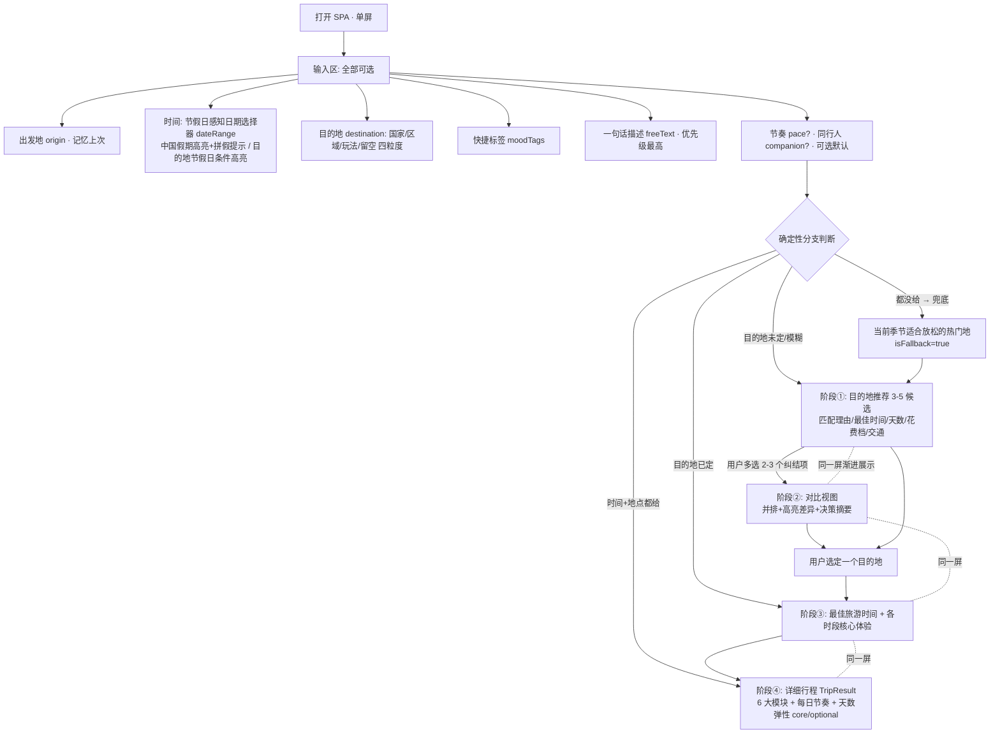

# 旅游行程规划应用 PRD（v2 · 双向匹配版）

> 文档版本：v2.0
> 状态：经 Owner 与用户多轮讨论的重大修订，已锁定方向，供 UI / 运营 / AI生成 / 测试 各 agent 照此执行
> 配套文档：`docs/schema.md`（带注释的数据结构说明）、`docs/schema.json`（机器可读 JSON Schema）

## 0. 相对 v1 的变更摘要（必读）

v2 是对产品逻辑的**重大修订**，核心是从“填满一张必填表单 → 出行程”转向“**双向匹配 + 渐进式精确**”。

| 维度 | v1 | v2 |
| --- | --- | --- |
| 输入哲学 | 7 项**必填**表单 | **零必填**，全部字段可选，自由度拉满 |
| 时间输入 | 模糊季节 + 模糊天数（两个字段） | **节假日感知日期选择器**，范围选择一次定时间+天数 |
| 目的地输入 | 必选具体国家 | 可选，**四种粒度**：国家 / 模糊区域 / 模糊玩法 / 留空 |
| 心情/目的 | 无 | **快捷标签**（自由文字的一键填充，非结构化维度） |
| 匹配方式 | 单向（输入→行程） | **双向**：给时间→补地点；给地点→补最佳时间；都给→行程；都不给→兜底 |
| 输出形态 | 直接出 1 份行程 | 一屏内**渐进展示**：推荐 →(多选)对比 → 最佳时间/各时段体验 → 详细行程 |
| 节假日 | 无 | 新增 `HolidayCalendar`（逐年、含调休、中国+目的地、**需每年更新**） |
| 内容库 | 景点/美食/预约/季节 | **新增** `bestSeasons`/`moodTags`/`idealDuration`/`signatureExperiencesByPeriod` |
| 行程弹性 | 固定天数 | 每天标 `core`/`optional`，可按实际假期裁剪 |
| 节奏/同行人 | 必填 | 保留但**可选**，智能默认（均衡 / 通用） |

数据契约新增结构：`UserInput`（全可选）、`HolidayCalendar`、`DestinationRecommendation`、`DestinationComparison`、`BestTimeOverview`。详见 `docs/schema.md` / `docs/schema.json`。

---

## 1. 统一核心原则（v2 的灵魂）

**双向匹配 + 输入模糊/输出精确 + 零必填 + 渐进式精确。**

- **输入端**自由度拉满、任何字段都不强制；**输出端**补全精确性。
- **双向匹配**——用户固定哪一头，系统智能补全另一头：
  - **给了时间**（哪怕较精确）→ 推荐匹配那段时间 + 快捷标签的【地点】。
  - **给了明确地点** → 给出【最佳旅游时间】+【各时间段的核心旅游体验】（如日本：春樱 / 夏祭花火 / 秋枫 / 冬雪温泉）。
  - **时间 + 地点都给** → 直接出精确详细行程。
  - **都没给**（“就想找地方放松一下”）→ 兜底推荐“当前季节适合放松的热门目的地”。
- **自由文字优先级最高**：一句话描述可覆盖任何其他维度。

---

## 2. 产品定位与目标用户

### 2.1 产品定位

一个**本地可运行的多人旅游行程规划单页应用（SPA）**。

- 纯前端静态站点，无后端服务；`python -m http.server` 即可在局域网内启动，同一 WiFi 下多人各自规划。
- 行程内容由两部分构成：
  1. **运营预置的真实数据**（目的地内容库 + 节假日数据集，离线静态 JSON）；
  2. **Claude API（`claude-opus-4-8`）实时生成/微调**的个性化推荐、对比与行程（在线调用）。
- 本地运行需用户自行配置 Claude API key（放在不入 git 的 `config.js` 占位文件里）。

### 2.2 目标用户

- 计划自由行、希望快速拿到一份「可直接照着走」行程的个人或小团队。
- 关键扩展：**还没想好去哪、只有一个模糊念头**（“国庆想出去玩”“就想放松一下”“在日本和泰国之间纠结”）的用户——v2 专门服务这类“尚未决策”的人群，先帮他们选地、对比，再出行程。

### 2.3 设计原则

- **零必填 / 输入模糊、输出精确**：任何字段都可不填，系统据已知信息补全。
- **双向匹配**：用户固定一头，系统补另一头。
- **渐进式精确**：一屏内分阶段展示，随用户确定性增加而逐步精确。
- **真实可溯源**：每条内容数据都带 `source`。
- **零部署门槛**：一条命令起服务，无需数据库、无需账号。

---

## 3. 输入端（极简、全部可选、自由度高）

> 全部字段对应 `UserInput`（见 schema）。**零必填**。

| # | 输入项 | 标识符 | 必填 | 说明 |
| --- | --- | --- | --- | --- |
| 1 | 出发地 | `origin` | 否 | 自由文本；记忆上次；影响出发地节假日高亮与交通估算 |
| 2 | 时间（节假日感知日期选择器） | `dateRange` | 否 | 范围选择一次定时间+天数；可跳过（走兜底） |
| 3 | 目的地 | `destination` | 否 | 四种粒度：国家 / 模糊区域 / 模糊玩法 / 留空 |
| 4 | 快捷标签（心情/目的） | `moodTags` | 否 | 自由文字的一键填充，非结构化维度 |
| 5 | 一句话自由描述 | `freeText` | 否 | 主入口，承载一切模糊性，**优先级最高** |
| 6 | 节奏 | `pace` | 否 | 特种兵/均衡/悠闲；不选→均衡 |
| 7 | 同行人 | `companion` | 否 | 五选一；不选→通用 |

### 3.1 时间 = 节假日感知的日期选择器（v2 重点）

取代旧的“模糊时间 + 模糊时长”。范围选择，一次同时确定时间和天数。

- **中国法定节假日常驻高亮**（按 `origin`）：整块假期标出、支持**一键选中整段**、可提示「**拼假/调休**」把短假拼长（数据来自 `HolidayCalendar(region=china)` 的 `start/end` + `makeupWorkdays` + `bridgeHint`）。
- **目的地法定节假日条件高亮**（仅当选了目的地国家才显示）：双向提示——🎉当地节庆（看点）/ ⚠️当地放假（闭馆、人多、涨价），数据来自目的地 `HolidayCalendar` 的 `destinationImpact`。
- **可跳过**（保住零必填）：跳过则走兜底推荐。

### 3.2 目的地（四种粒度）

- **具体国家**：`granularity=country`，v1 为 `japan`/`thailand`/`france`。
- **模糊地理区域**：`granularity=region`，如“东南亚”“欧洲”（`regionText`）。
- **模糊玩法**：`granularity=playstyle`，如“海岛”“雪山”“温泉”（`playstyleTags`，复用 moodTag 取值，靠内容库 `moodTags` 桥接匹配）。
- **完全留空**：`granularity=none`。

### 3.3 快捷标签（心情/目的）

- 本质是“**自由文字的一键填充**”，**不是结构化维度**。例：🏝️想放松 `relax` / 🔥想玩透 `explore` / 🍜想吃好吃的 `food` / 📷想看风景 `scenery`。
- 喂给推荐引擎：“放松”同时影响**选地**（海岛/温泉/慢城）和**默认节奏**（悠闲）。

### 3.4 一句话自由描述

- 主入口，承载一切模糊性，**优先级最高**，可覆盖任何其他维度。
- 例：用户选了“特种兵”但写“带娃别太累”→ 以文字为准放慢节奏。

### 3.5 节奏 / 同行人

- 保留但**可选**，智能默认：不选节奏→`balanced`（若标签含 `relax` 则 `relaxed`）；不选同行人→通用。
- 节奏：特种兵 `intense` / 均衡 `balanced` / 悠闲 `relaxed`。
- 同行人：独自 `solo` / 情侣蜜月 `couple` / 亲子带娃 `family_kids` / 长辈同行 `elderly` / 朋友结伴 `friends`。

---

## 4. 输出端（精确、分层、单屏内渐进展示）

整个输出在**一屏内分阶段陆续展示**（不是硬跳页），按用户确定性走不同分支。

- **目的地未定/模糊** → 【目的地推荐 `DestinationRecommendation`】3–5 个候选，每个带：匹配理由（贴合时间/标签）、最佳到访时间、建议天数、大致花费档、从出发地交通。
- 推荐里用户可**多选 2–3 个还在纠结的** → 【对比视图 `DestinationComparison`】并排呈现、**高亮差异**、附一句“为什么选 A 不选 B”的决策摘要。对比维度：与所选时间契合度（结合当地节假日）/ 建议天数 vs 假期 / 花费档 / 累不累（节奏）/ 特色侧重 / 出发地交通。
- **目的地已定** → 先展示【最佳旅游时间 + 各时段核心体验 `BestTimeOverview`】，再 → 【详细行程】。
- **详细行程 `TripResult`**：固定 **6 大模块**（路线 / 按天安排 / 景点 / 美食 / 需预约项 / 季节建议）+ 每日 `intensity` 节奏标记 + **天数弹性**（`dayType`=核心天 `core` / 可选延展天 `optional`，配合 `flexibility` 便于按实际假期裁剪）。

兜底：时间与目的地都未给 → `DestinationRecommendation` 且 `isFallback=true`（当前季节适合放松的热门目的地）。

---

## 5. 信息架构 / 页面流程（单屏渐进）



流程概览：`输入(全可选) → [推荐 →(多选)对比] 或 [最佳时间/各时段体验] → 详细行程`，**单屏渐进**。

页面交互要点：

- 输入区任何字段都可不填，随填随出（后续阶段按确定性逐步出现，不硬跳页）。
- 日期选择器需常驻渲染中国节假日高亮；选了目的地国家后叠加目的地节假日提示。
- 在线调用 Claude API 期间显示加载态；未配置 key 或失败时给明确错误，引导检查 `config.js`。
- 用户可随时回到输入区修改并重新触发对应阶段。

---

## 6. 功能清单（v1 必做 / v2 预留）

### 6.1 v1 必做

| 编号 | 功能 | 说明 |
| --- | --- | --- |
| F-1 | 全可选输入区 | 7 个输入项全部可选（零必填） |
| F-2 | 节假日感知日期选择器 | 范围选择定时间+天数；中国假期高亮+一键选中+拼假提示；目的地节假日条件高亮 🎉/⚠️ |
| F-3 | 目的地四粒度输入 | 国家 / 模糊区域 / 模糊玩法 / 留空 |
| F-4 | 快捷标签 | 自由文字一键填充，影响选地与默认节奏 |
| F-5 | 一句话自由描述 | 优先级最高，可覆盖其他维度 |
| F-6 | 节奏/同行人（可选默认） | 不选→均衡/通用 |
| F-7 | 目的地推荐 | 3–5 候选，含匹配理由/最佳时间/天数/花费档/交通；含兜底 |
| F-8 | 对比视图 | 多选 2–3 并排、高亮差异、决策摘要 |
| F-9 | 最佳时间 + 各时段体验 | 目的地已定时先展示 |
| F-10 | 详细行程 6 大模块 | 路线/按天/景点/美食/预约/季节 + 每日节奏 + 天数弹性 |
| F-11 | 目的地内容库加载 | 静态 JSON，日本/泰国/法国三国（含 v2 新字段） |
| F-12 | 节假日数据集加载 | `HolidayCalendar` 逐年，中国+三国 |
| F-13 | Claude API 实时生成 | `claude-opus-4-8`，输出符合各结果 Schema |
| F-14 | source 来源展示 | 每条内容显示出处 |
| F-15 | 本地多人访问 | `python -m http.server`，局域网各自独立 |
| F-16 | API key 本地配置 | `config.js` 占位文件，`.gitignore` 排除 |
| F-17 | 加载态与错误处理 | 生成中/失败/未配置 key 提示 |

### 6.2 v2 预留（Schema 留字段，v1 不实现）

| 编号 | 功能 | 说明 |
| --- | --- | --- |
| V2-1 | 主题偏好维度（多选） | `themes` 字段，前端不渲染、AI 不读取 |
| V2-2 | 预算档位维度（单选） | `budget` 字段，前端不渲染、AI 不读取 |
| V2-3 | 更多目的地国家 | 内容库/节假日 Schema 已支持扩展 |

---

## 7. 核心用户故事

### 7.1 双向匹配各分支

- **US-1（给时间→补地点）**：作为已订国庆 7 天假的用户，我只在日期选择器一键选中“国庆”、点了“想吃/想放松”，期望系统**推荐 3–5 个匹配那段时间和心情的目的地**，每个带最佳到访时间、建议天数、花费档和从我出发地的交通。
- **US-2（给地点→补最佳时间）**：作为已经认定“想去日本”的用户，我没填时间，期望系统先告诉我**日本的最佳旅游时间和各时段核心体验**（春樱/夏祭花火/秋枫/冬雪温泉），再据此出行程。
- **US-3（时间+地点都给→直接行程）**：作为时间地点都定好的用户（10/1–10/5 去日本），期望直接拿到一份精确详细行程。
- **US-4（都没给→兜底）**：作为“**啥都没想好，就想找个地方放松一下**”的用户，我什么都不填，期望系统兜底推荐“**当前季节适合放松的热门目的地**”。

### 7.2 对比与决策场景

- **US-5（在几个地区徘徊）**：作为在“日本 vs 泰国”之间徘徊的用户，我从推荐里**多选 2–3 个**，期望看到**并排对比 + 高亮差异**（与时间契合度、天数 vs 假期、花费、累不累、特色、交通）和一句“为什么选 A 不选 B”的决策摘要。

### 7.3 节假日感知场景

- **US-6（拼假）**：作为想把短假拼长的用户，期望日期选择器高亮中国法定假期并提示“**请 2 天年假可拼出更长假期**”。
- **US-7（目的地节假日双向提示）**：作为选了日本的用户，期望在日期选择器看到目的地节假日提示——🎉黄金周有祭典看点 / ⚠️黄金周景点人多、酒店涨价。

### 7.4 自由文字优先级场景

- **US-8（文字覆盖维度）**：我节奏选了“特种兵”，但一句话写“**带娃别太累**”，期望以文字为准放慢节奏并增加亲子内容。
- **US-9（约束/忌口）**：我写“人均预算 8000 以内、不吃海鲜”，期望推荐与行程相应避开高价项与海鲜。

### 7.5 行程弹性与通用

- **US-10（天数弹性）**：拿到 5 天行程后我发现假期只有 4 天，期望能看出哪些是**核心天**、哪些是**可选延展天**，按实际假期裁剪。
- **US-11（来源可溯）**：每条推荐内容我都能看到 `source`。
- **US-12（本地多人）**：局域网内多人各自独立打开页面、互不干扰地规划。

---

## 8. 内容/结果模块字段说明

详细行程结果区固定输出 **6 大模块**，对应 `TripResult`。完整字段见 `docs/schema.md` / `docs/schema.json`，此处给出业务说明。

| 模块 | Schema 字段 | 说明 |
| --- | --- | --- |
| 1. 最佳出行路线 | `route` | 出发地→目的地交通建议，含 `source` |
| 2. 按天行程安排 | `dailyPlan[]` | 每天：序号、主题、活动/美食/预约；体现节奏 `intensity`；天数弹性 `dayType`(core/optional) |
| 3. 景点推荐 | `dailyPlan[].activities[]` | 名称、简介、时间段、建议时长、`source` |
| 4. 美食推荐 | `dailyPlan[].meals[]` | 名称、餐段、推荐理由、`source` |
| 5. 需提前预约项目 | `reservations[]` | 项目名、预约方式、建议提前时长、`source` |
| 6. 季节相关建议 | `seasonalTips[]` | 基于季节的穿衣/天气/活动建议、`source` |

节奏在数据里的体现：`intense` 每日 4–6 项、`balanced` 2–4 项、`relaxed` 1–2 项含留白；顶层 `meta.pace` + 每日 `intensity` 标记。

天数弹性：每个 `dailyPlan[].dayType` 标 `core`（核心天，假期短也保留）或 `optional`（可选延展天，假期长时加上）；顶层 `flexibility` 汇总 `coreDays`/`optionalDays` 与裁剪建议。

---

## 9. 给其他 Agent 的交付接口契约

### 9.1 UI Agent —— 按什么渲染

- **输入区**：按第 3 节渲染 7 个**全可选**输入项。时间用节假日感知日期选择器（中国假期常驻高亮 + 拼假提示；选了目的地国家叠加 `destinationImpact` 提示）；目的地支持四粒度切换；快捷标签为可多选 chip；自由文字 textarea。
- **输出区（单屏渐进）**：按确定性分阶段渲染——
  - 未定/模糊 → 渲染 `DestinationRecommendation`（候选卡片，展示匹配理由/最佳时间/天数/花费档/交通）；
  - 用户多选 2–3 → 渲染 `DestinationComparison`（并排表格，对 `dimensions[].highlightDiff=true` 的行高亮，展示 `decisionSummary`）；
  - 目的地已定 → 渲染 `BestTimeOverview`（最佳季节 + 各时段体验）；
  - 最终 → 渲染 `TripResult` 6 大模块，按 `meta.pace` / `dailyPlan[].intensity` 体现节奏差异，按 `dayType` 标记核心/延展天并支持裁剪提示。
- 每条内容都要渲染其 `source`。
- v2 字段（`themes`/`budget`）数据中可能为空，**v1 不渲染**。
- 数据来源：推荐/对比/最佳时间/行程来自 AI 生成模块返回值；节假日高亮来自 `HolidayCalendar` 静态数据。

### 9.2 运营 Agent —— 按什么填数据

- **目的地内容库 `DestinationLibrary`**：v1 必交三国 `japan`/`thailand`/`france`。每国含 `attractions`/`foods`/`reservations`/`seasonalTips`，**每条强制带 `source`**；并新增 v2 字段 `bestSeasons`/`moodTags`/`idealDuration`/`signatureExperiencesByPeriod`（同样每条带 `source`）。`moodTags` 取值须与 `UserInput` 同一套，以支持玩法型模糊匹配。
- **节假日数据集 `HolidayCalendar`**：**逐年**维护（每个 `(region, year)` 一份），含 `year`、含调休 `makeupWorkdays`。覆盖 **2026**（如已公布则含 2027）。地区：中国 `china`（出发地高亮，配 `bridgeHint` 拼假提示）+ 日本/泰国/法国（目的地高亮，配 `destinationImpact`）。每条带 `source`。**⚠️ 这是需每年更新维护的数据**——各国法定假期与中国调休逐年公布，运营须每年滚动更新。
- **交通信息 `TransportInfo`**：出发地→目的地（飞行时长/是否直飞，origin 相关，可估算），用于推荐/对比/行程。
- 数据需联网检索真实信息，不得编造。v2 预留字段（`themes`/`budget`/`budgetNotes`）可留空。

### 9.3 AI 生成 Agent —— 输入输出契约

**输入（组装 Prompt 时使用）：**

```json
{
  "userInput": {
    "origin": "上海",
    "dateRange": { "start": "2026-10-01", "end": "2026-10-07", "days": 7, "anchoredHolidayId": "cn-2026-national-day" },
    "destination": { "granularity": "none", "country": null, "regionText": "", "playstyleTags": [] },
    "moodTags": ["relax", "food"],
    "freeText": "带爸妈别太累",
    "pace": null,
    "companion": "elderly",
    "themes": [],
    "budget": null
  },
  "libraryData": { "japan": { /* DestinationLibrary */ }, "thailand": {}, "france": {} },
  "holidayData": [ { /* HolidayCalendar(china,2026) */ }, { /* japan,2026 */ } ]
}
```

**契约要求：**

- 模型固定 `claude-opus-4-8`。
- **自由文字 `freeText` 优先级最高**，凌驾于所有结构化字段，生成时优先满足。
- **双向匹配分支判断**（决定输出哪个结构）：
  - 目的地未定/模糊（granularity ≠ country）→ 输出 `DestinationRecommendation`（3–5 候选）；用户多选后追加 `DestinationComparison`。
  - 目的地已定（country）且无 `dateRange` → 先 `BestTimeOverview`，再 `TripResult`。
  - 目的地已定 + 有 `dateRange` → 直接 `TripResult`。
  - 时间与目的地都未给 → `DestinationRecommendation` 且 `isFallback=true`（当前季节适合放松的热门地）。
- 推荐/对比须结合 `holidayData`（目的地 `destinationImpact`）评估时间契合度与人潮/涨价风险。
- 节奏未给时默认 `balanced`（标签含 `relax` 则 `relaxed`）；同行人未给走通用。
- 应优先复用 `libraryData` 真实条目并透传其 `source`；库外补充须自带真实 `source`，禁止编造。
- 节奏在每日活动密度上体现；`TripResult` 须标 `dayType`(core/optional) 并给 `flexibility`。
- **输出必须是符合对应 Schema 的纯 JSON**，不含多余文字。

### 9.4 测试 Agent —— 验证依据

- 校验 `UserInput` 全字段可选（空对象 `{}` 合法）。
- 校验各输出结构符合 Schema：`DestinationRecommendation`（1–5 候选、含必填项、`isFallback`）、`DestinationComparison`（2–3 项、含 `dimensions`/差异高亮）、`BestTimeOverview`、`TripResult`（6 大模块、每日 `dayType`、`flexibility`）。
- 校验双向匹配分支：四种输入组合各自走对分支、兜底场景 `isFallback=true`。
- 校验 `DestinationLibrary` 含 v2 新字段且每条带 `source`。
- 校验 `HolidayCalendar` 逐年（含 `year`）、含调休、中国+三国齐备、每条带 `source`。
- 校验节奏密度差异、天数弹性可裁剪、自由文字覆盖效果。
- 校验三国样板数据 + 节假日数据存在且可加载。

---

## 10. 验收标准

1. **零必填**：输入区任何字段都可不填仍能推进；空输入走兜底推荐。
2. **双向匹配**：四种输入组合（仅时间 / 仅地点 / 两者 / 皆无）各自走对输出分支。
3. **节假日感知日期选择器**：中国法定假期高亮、可一键选整段、有拼假提示；选目的地国家后显示目的地节假日 🎉/⚠️ 提示。
4. **目的地四粒度**：国家/区域/玩法/留空均可输入且被正确处理。
5. **推荐可用**：目的地未定时给 3–5 候选，每个含匹配理由/最佳时间/天数/花费档/交通。
6. **对比可用**：多选 2–3 候选 → 并排 + 高亮差异 + 决策摘要。
7. **给地点→最佳时间**：目的地已定时先展示最佳时间 + 各时段核心体验。
8. **详细行程 6 大模块齐全**：路线/按天/景点/美食/预约/季节。
9. **节奏差异可见**：`intense`/`balanced`/`relaxed` 每日密度差异可观察。
10. **天数弹性**：行程标出核心天/可选延展天，可按假期裁剪。
11. **自由文字生效**：`freeText` 能覆盖/微调其他字段。
12. **来源可溯**：每条内容显示 `source`。
13. **数据就绪**：三国内容库（含 v2 新字段）+ 中国/三国节假日（逐年含调休）存在且可加载。
14. **节假日数据维护说明**：文档明确 `HolidayCalendar` 需每年更新。
15. **本地多人运行**：`python -m http.server` 启动后局域网多人各自独立规划。
16. **key 安全**：`config.js` 未入 git，仓库不含真实 API key。
17. **错误处理**：未配置 key 或生成失败时有明确提示。
18. **v2 字段预留**：`themes`/`budget` 在 Schema 中存在且 v1 不渲染、不影响功能。

---

## 11. 附：术语与枚举一览

- 节奏 `pace`（可选，默认 `balanced`）：`intense` | `balanced` | `relaxed`
- 同行人 `companion`（可选，默认通用）：`solo` | `couple` | `family_kids` | `elderly` | `friends`
- 季节 `season`：`spring` | `summer` | `autumn` | `winter`
- 目的地粒度 `destination.granularity`：`country` | `region` | `playstyle` | `none`
- 目的地国家 `country`（v1）：`japan` | `thailand` | `france`
- 快捷标签/玩法 `moodTag`（建议值，可扩展）：`relax` | `explore` | `food` | `scenery` | `island` | `snow` | `hotspring` | `slow` | `culture` | `shopping`
- 花费档 `costTier`（推荐/对比用）：`low` | `medium` | `high`
- 节假日地区 `HolidayCalendar.region`：`china` | `japan` | `thailand` | `france`
- 节假日类型 `type`：`statutory_holiday` | `festival` | `both`
- 目的地影响 `destinationImpact.highlight`：`festival`(🎉) | `closure_crowd_price`(⚠️) | `both`
- 天数弹性 `dayType`：`core` | `optional`
- （v2 预留）主题 `themes`：`food` | `nature` | `history` | `shopping` | `photography` | `kids_fun`
- （v2 预留）预算 `budget`：`economy` | `comfort` | `luxury`
